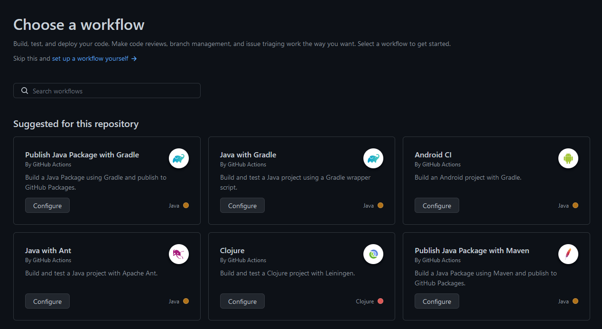
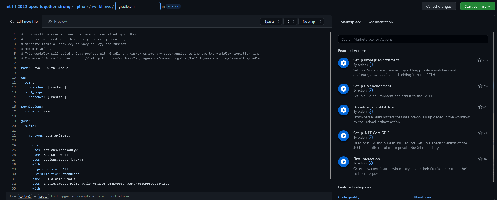

# Build keretrendszer és CI
## Beüzemelés
A build keretrendszer és a continuous integration hasznos eszközei a mondern szoftverhkészítésnek és -tesztelésnek. Ennek beüzemelése nem tartozik a legnehezebb feladatok közé, ugyanis felhasználóbarát módon lehet használatra, működésrekész állapotba hozni.

A github webes felületén az _Actions_ fül alatt lehet kezelni a már hozzáadott workflow-kat, valamint itt lehet inicializálni újat.

Új létrehozása esetén ki kell választani a megfelelőt (jelen esetünkben ez a _Java with Gradle_), majd ezután megfelelően módosítani a konfigurációs fájlt.

A [build.gradle](/build.gradle) fájlban különböző hibák miatt módosítani kell kicsit a _wrappert_.

Miután ezekkel a lépésekkel végeztünk, az _Actions_ fül alatt kiválasztva a sajátunkat (_Java CI with Gradle_) láthatjuk a futások eredményét valamint azok részletezését.

## Eredmények és összefoglalás
Ezzel a beüzemeléssel elértük, hogy minden _pusholás_ után a projekt le legyen buildelve és az esetleges hibákat feltárja. Ez hasznos lehet nagyobb, komplexebb, akár több technológiát alkalmazó projektek készítesekor. A modern szoftverfejlesztés megköveteli, hogy CI technikákat alkalmazzanak a fejlesztők, mert ezzel átláthatóbb és nyomonkövethetőbb lesz a projekt.