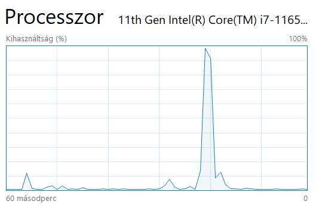

# Nem funkcionális jellemzők vizsgálata
A nem funkcionális jellemzők vizsgálatához először felvettem az eredeti projekt leírásában található Person péla osztályt. Ezután, hogy legyen mit futtatni a projektben, létrehoztem egy Main osztályt, ezen belül a main függvényt. Ezen belül létrehoztam két ciklust, mindkettő elindít 20000 szálat, és azokban létrehoz RDF objektumokat Person objektumokból, vagy visszafejt Person objektumokat RDF objektumokból.

 A függvény kiírja, összesen mennyi időre volt szükség a műveletek elvégzéséhez, valamint, hogy átlagosan hány miliszekundum alatt hajtódott végre egy művelet.

 

Ezen kívül a windiws beépített teljesítmény figyelőjében megnéztem, mi történik a processzorral a projekt futtatásakor.

