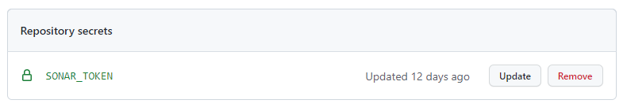
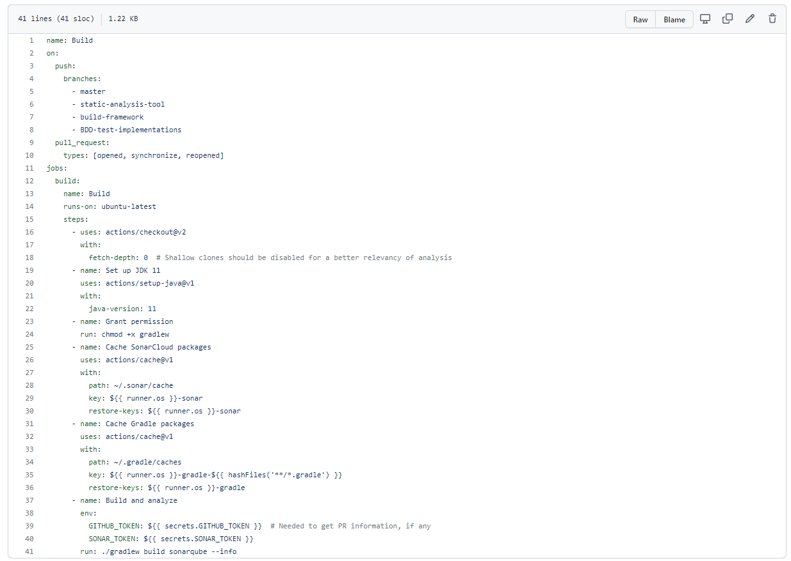
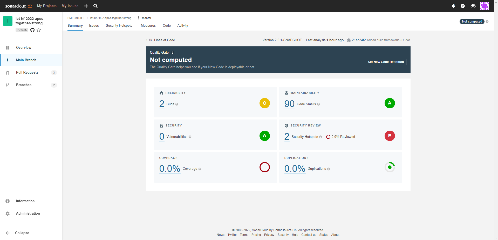

# Statikus analízis eszköz
## SonarCloud
Egy statikus analízis eszköz hasznos lehet a projektre nézve, mivel segítségével végrehajtás nélkül lehet vizsgálni a szoftvert. Képes hibák, code smellek és más hasznos információk megállapítására.

Első lépésként a SonarCloud oldalon való bejelentkezés után hozzáadtam a fiókomhoz a projektünket, majd a CI-based analysis metódusok közül a Github Actions-t választottam. Az inicializáláshoz szükség volt a Github projektnél Secrets-ek létrehozására, melynek nevét és értékét megadta a SonarCloud.

Ezek után létrehoztam a build.yml fájlt, melynek tartalmában szintén segítségemre volt a SonarCloud, néhány apró módosításra volt szükség még. 

A szükséges lépések megtétele után azt tapasztaltam, hogy a Github Action lefut, viszont a SonarCloud analízise nem érzékeli a nagy kóbázist, amin az analízis kell végeznie. Erre az jelentett megoládst, hogy pull request-tel összemerge-ltem a saját ágamat és a master ágat. A merge után az analízis lefutott, és ezt a visszajelzést adta nekünk.

